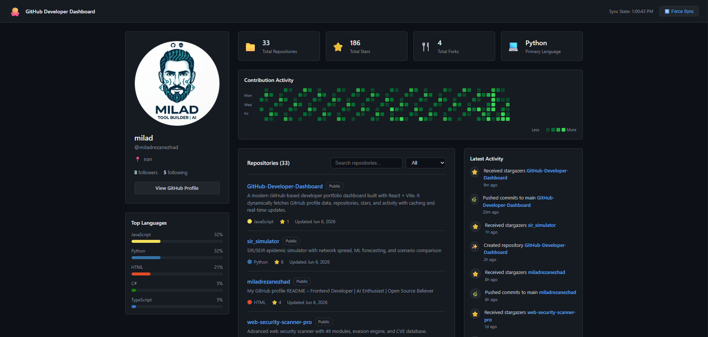

# 💎 GitHub Developer Dashboard

<div align="center">



# 🔒 GitHub Developer Dashboard

</div>


---

## 🚀 Overview

A **modern developer portfolio dashboard** that dynamically visualizes GitHub profile data, repositories, contributions, and coding activity in a clean, minimal, and interactive UI.

Built for developers who want a **live, automated, and data-driven portfolio** instead of a static resume.

---

## 🎯 Features

* ⚡ Live GitHub profile integration (repos, stars, followers)
* 📊 Dynamic contribution graph visualization
* 🧠 Categorized project filtering system
* 💻 Interactive terminal-style developer identity section
* 📈 Language usage breakdown
* 📬 Contact form UI (frontend simulation)
* 🌙 Modern dark UI with cyber-inspired design
* 🔄 Fully responsive (mobile + desktop)

---

## 🖥️ Demo

👉 Live Demo:
[https://your-deployment-url.com](https://your-deployment-url.com)

---

## 🎬 Preview


> If GIF is not available yet, you can create one using:

* ScreenToGif (Windows)
* LICEcap
* OBS Studio

---

## 🧰 Tech Stack

* ⚛️ React 18
* ⚡ Vite
* 🎨 TailwindCSS / Custom CSS
* 📡 GitHub REST API
* 🧩 Component-based architecture

---

## 📦 Installation

```bash
git clone https://github.com/miladrezanezhad/GitHub-Developer-Dashboard.git
cd GitHub-Developer-Dashboard
npm install
npm run dev
```

---

## 🏗️ Build

```bash
npm run build
```

---

## 🌍 Deployment

You can deploy easily on:

* 🔵 Vercel
* 🟢 Netlify
* 🟣 Render
* ⚫ Cloudflare Pages

Build output:

```bash
dist
```

---

## 🔐 Environment Variables

Create a `.env` file:

```env
VITE_GITHUB_TOKEN=your_github_token
VITE_GITHUB_USERNAME=miladrezanezhad
```

---

## 📁 Project Structure

```
src/
 ├── components/
 ├── hooks/
 ├── assets/
 ├── App.jsx
 └── main.jsx
```

---

## 📊 GitHub Integration

This project uses GitHub API to fetch:

* Repositories
* Stars
* Followers
* Languages
* Contribution data

---

## ⚠️ Rate Limit Note

GitHub API has rate limits.
Using a token increases limit significantly.

---

## 👨‍💻 Author

**Milad Rezanezhad**

* GitHub: [https://github.com/miladrezanezhad](https://github.com/miladrezanezhad)
* Portfolio: [https://your-site.com](https://your-site.com)

---

## ⭐ Support

If you like this project:

* ⭐ Star the repository
* 🍴 Fork it
* 🧠 Contribute improvements

---

## 📜 License

This project is open-source under the MIT License.

